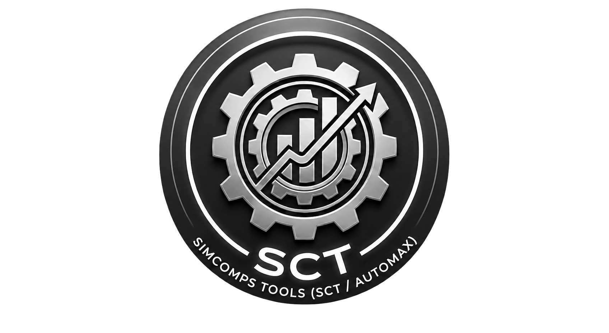
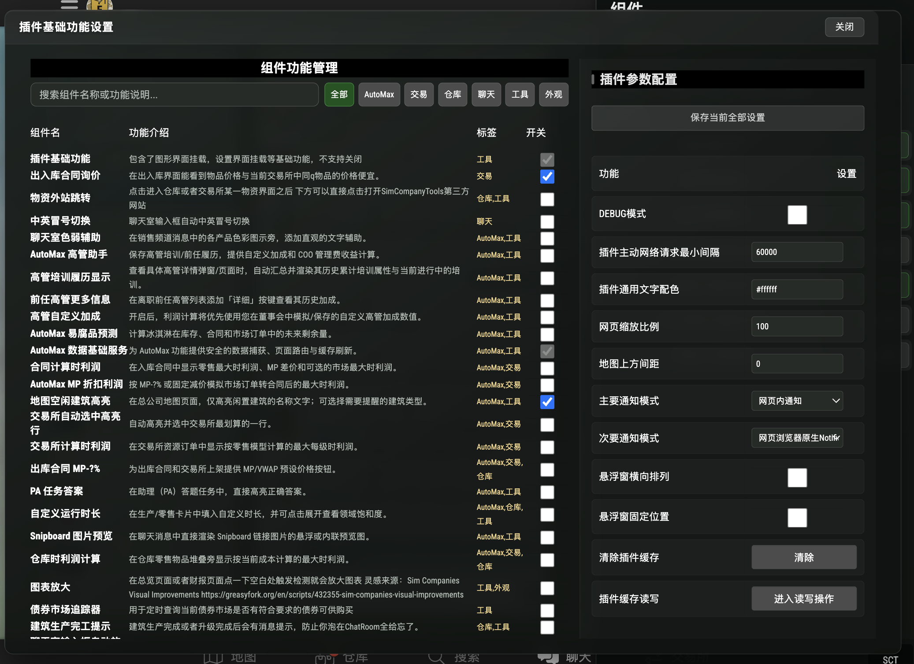
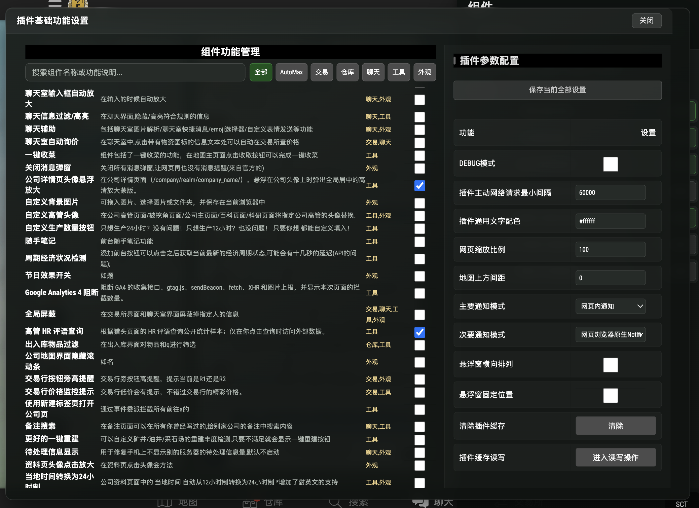
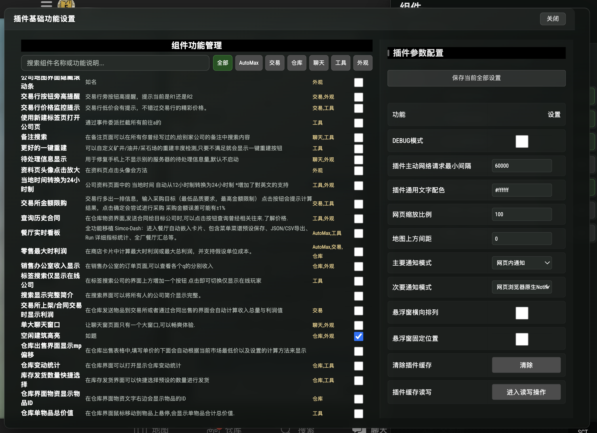
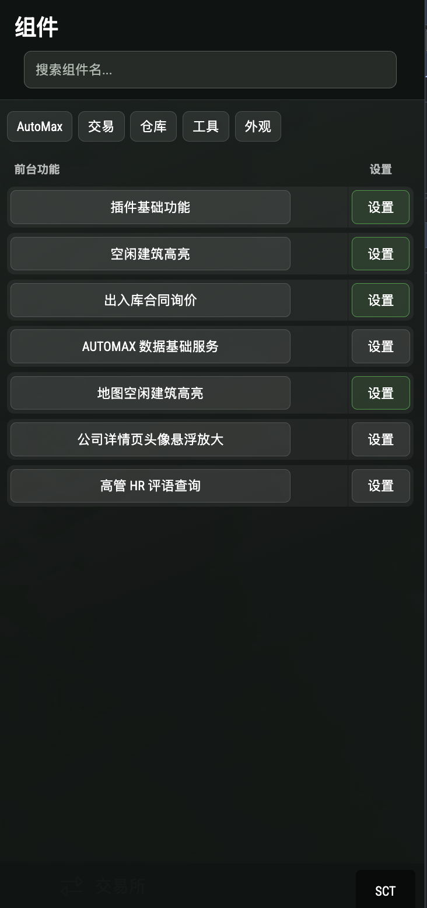

<p align="center">
  
</p>

<h1 align="center">SimComps Tools (SCT / AutoMax)</h1>

<p align="center">
  面向 <a href="https://www.simcompanies.com/">Sim Companies</a> 的全功能模块化浏览器脚本助手
</p>

<p align="center">
  
  
  
  
  
</p>

---

## 📌 目录 (Table of Contents)

- [📖 项目简介](#-项目简介)
- [✨ 核心亮点](#-核心亮点)
- [🖼️ 界面预览](#-界面预览)
- [⚡ 快速安装](#-快速安装)
- [🛠️ 功能概览](#-功能概览)
- [⚠️ 高风险自动化安全机制](#️-高风险自动化安全机制)
- [📄 许可协议与致谢](#-许可协议与致谢)

---

## 📖 项目简介

**SimComps Tools (SCT)** 是一款专为 *Sim Companies* 经营策略游戏打造的高性能、模块化 Browser Userscript 插件集。它将常用的商业数据分析、仓库出入库统计、市场利润精算、高管与董事会决策辅助、聊天频道增强以及外观自定义等 67+ 项功能整合成统一的响应式组件系统。

> 💡 **免责声明**：本项目由 **LIYUE** 开发维护。本项目非 *Sim Companies* 官方出品，与游戏官方开发者无关联。

---

## ✨ 核心亮点

- **🧩 极简按需开启**：默认仅启用“插件基础功能”，其余所有组件初始保持关闭，按需自由开关，零额外资源占用。
- **🖥️ 96vw×94vh 全屏高保真设置页**：全新设计的双栏全屏面板，集成了**实时关键词搜索**与**分类 Tag 标签联动筛选**。
- **🎯 统一移动窗口宿主**：摒弃传统脚本各自创建乱糟糟弹窗的弊端，采用单实例 `secondaryWindowHost` 保证沉浸式体验。
- **📊 商业决策与智能分析**：提供餐厅长期看板、零售最佳利润精算、出入库动态过滤、经营日报与高管培养日志。
- **🛡️ 隐私防护与 GA4 阻断**：支持原生阻断 GA4 追踪请求，提供脱敏的 HTTP / SSE 请求元数据安全查看与导出。

---

## 🖼️ 界面预览

<p align="center">
  <b>全屏组件管理与分类 Tag 筛选</b>
  <br/>
  
</p>

<br/>

<div align="center">

| 全局面板与功能控制 | 关键词实时搜索与组件开关 |
| :---: | :---: |
|  |  |

</div>

<br/>

<p align="center">
  <b>悬浮控制节点与游戏实操页面增强</b>
  <br/>
  
</p>

---

## ⚡ 快速安装

1. **准备环境**：在浏览器（Chrome / Edge / Firefox / Safari）中安装 Userscript 脚本管理器扩展：
   - [Tampermonkey (油猴)](https://www.tampermonkey.net/) *(推荐)*
   - [Violentmonkey (暴力猴)](https://violentmonkey.github.io/)
2. **获取脚本**：从 [Releases](../../releases) 下载最新 ZIP 发行包，解压后获取 `build.user.js`。
3. **导入运行**：将 `build.user.js` 拖入脚本管理器中安装，随后打开 [Sim Companies](https://www.simcompanies.com/) 游戏页面。
4. **开始使用**：页面右下角将自动浮现 **SCT** 悬浮控制按钮，点击【设置】即可开启你的定制化商业辅助体验！

---

## 🛠️ 功能概览

> 📖 详细功能的逐项操作说明请阅读 [FEATURE_GUIDE.md](docs/FEATURE_GUIDE.md)。

| 模块分类 | 代表功能 | 说明 |
| :--- | :--- | :--- |
| **仓库与生产** | 出入库过滤、物品 ID、库存统计、自定义生产数量 | 支持快速检索仓储物品与精准生产计划设置 |
| **交易与市场** | 交易所最佳利润自动高亮、市场参考价、合同询价 | 自动比较各品级/价格净收益，智能高亮下单 |
| **餐厅与日报** | 餐厅实时看板、长期结算 CSV 导出、经营日报 | 详细统计餐饮客流量、收入曲线与历史日报 |
| **聊天与资料** | 聊天过滤器、色弱辅助、快捷工具、备注搜索 | 过滤广告消息，高亮显示关键求购信息 |
| **外观与特效** | 自定义背景壁纸、高斯模糊、节日特效、空闲高亮 | 打造专属个性化游戏界面与视觉提醒 |
| **隐私与安全** | GA4 跟踪阻断、SSE / XHR 请求脱敏导出 | 保护玩家隐私，阻断不必要的第三方追踪 |
| **AutoMax** | 董事会与高管决策辅助、利润计算与饱和度分析 | 商业决策深度计算与管理看板 |

---

## ⚠️ 高风险自动化安全机制

为遵守游戏公平竞技倡导，以下代替玩家执行连续页面交互的功能**默认严格关闭**：

- 🌾 **一键收菜** (staggered 500-900ms 随机延迟模拟)
- 🏗️ **更好的一键重建**
- 🛒 **交易所金额限购**

首次手动开启上述任一敏感功能时，插件将弹出安全确认窗口。用户必须亲手输入文本：

```text
我已知晓风险自担
```

*注：此确认机制为用户自发确认，不代表游戏官方授权许可。请使用者严格遵循 Sim Companies 游戏规则与玩家条款。*

---


## 📄 许可协议与致谢

- 插件基础框架及 LIYUE 编写的核心组件采用 **[MIT License](LICENSE)** 协议开源。
- 涉及 AutoMax 相关的组件采用 **[AGPL-3.0-or-later](LICENSE)** 协议。
- 详细的文件协议归属与声明参见 [LICENSE-MAP.md](docs/LICENSE-MAP.md) 及 [NOTICE.md](docs/NOTICE.md)。

**项目致谢**：
- [gangbaRuby/SimCompanies-Scripts](https://github.com/gangbaRuby/SimCompanies-Scripts)
- [ShenHaiSu/SimComp-Tools](https://github.com/ShenHaiSu/SimComp-Tools)
